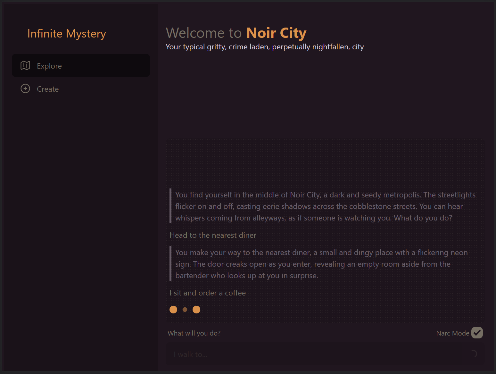

# infinite-mystery

AI guided text based adventures.

Create and solve mysteries to solve under the guidance of an AI Dungeon Master.



## Development

Infinite Mystery is built as a full stack application inside of a turborepo monorepo

Here's what you need to get started developing:

- [nvm](https://github.com/nvm-sh/nvm)
- [Yarn](https://yarnpkg.com/)
- [Docker](https://www.docker.com/)
- [Docker Compose](https://docs.docker.com/compose/)

Setting up your development environment:

```bash
# From the root of the project

# Install nvm
curl -o- https://raw.githubusercontent.com/nvm-sh/nvm/v0.35.3/install.sh | bash
# Install the project version of node
nvm install
# Install yarn
npm install -g yarn
# Install dependencies
yarn
# Setup environment variables
cp .env.example .env # then edit .env to fill in required variables
# Start required docker containers
yarn d-up # see package.json for other docker commands
# Initialize the database
yarn db-init
# Optionally seed the database
yarn db-seed
yarn workspace database db:generate-images
# Start the server
yarn dev
```

## Workflow

### Branches

- `main` is the main branch. It is protected and requires PRs to be merged into it. It is auto-deployed to https://infinitemystery.app/
- `staging` is the staging branch. New branches should branch off of this. It is auto-deployed to https://infinite-mystery-staging.up.railway.app/

### Developing a new feature

1. Create a new branch off of `staging` with a descriptive name
2. Develop your feature
   - `yarn dev` will spin up the server and watch changes to `apps/web` to auto-reload
     - You will need to `ctrl-c` and restart `yarn dev` if you make changes anywhere else, like `packages/ai-client`
   - `yarn ci` will run the full test suite that CI would run
   - `yarn d-up` will standup the database and other services
   - `yarn d-down` will tear down the database and other services when you are down
3. When you are ready to merge your branch, create a PR against `staging`
4. Once your PR is approved, merge it into `staging`
5. Once your PR is merged into `staging`, it will be auto-deployed to https://infinite-mystery-staging.up.railway.app/
